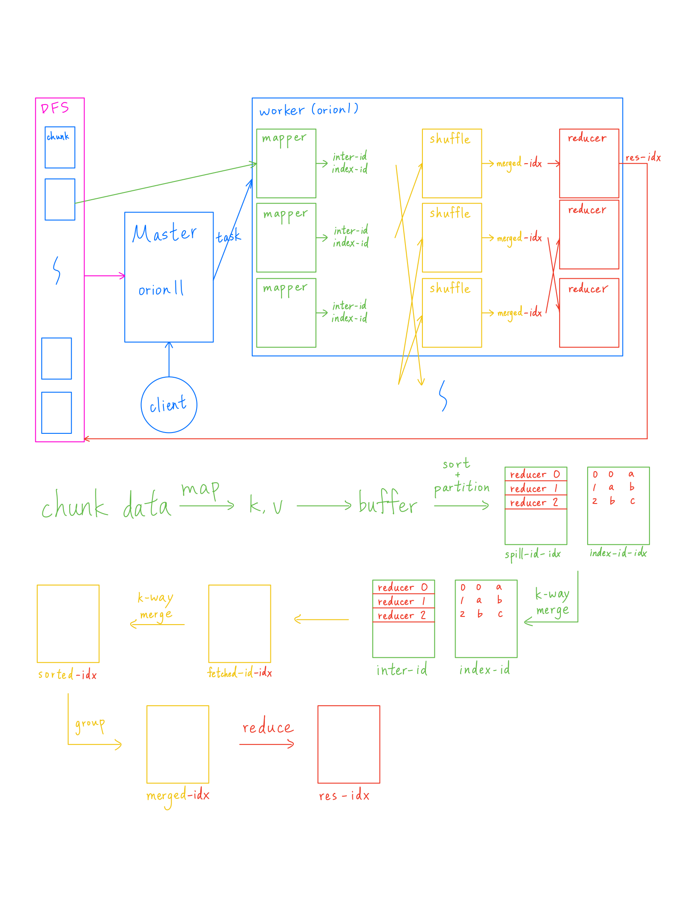

# Project 2

https://www.cs.usfca.edu/~mmalensek/cs677/assignments/project-2.html

## USFCA Machines
21 machines for storage and computation: orion01-12 except 11, mc01-10 \
controller and master runs on orion11

## Architecture
<center>
  
</center>
dfs base directory = /bigdata/students/whsiao5/mydfs/ \
chunk path: filename/chunk_<chunk_id> \
checksum path: filename/chunk_<chunk_id>.chksum \

mapreduce base directory = /bigdata/students/whsiao5/mr/ \
job directory = <job_id> \
plugin file: plugin.so \
map: <mapper_id>  = <file_name>-<chunk_id> \
&emsp;spill file with index: spill-<mapper_id>-<spill_idx>, index-<mapper_id>-<spill_idx> \
&emsp;intermediate file with index: inter-<mapper_id>, index-<mapper_id> \
shuffle: \
&emsp;fetched file: fetched-<mapper_id>-<reducer_idx> \
&emsp;sorted file: sorted-<reducer_idx> \
&emsp;merged file: merged-<reducer_idx> \
reduce: \
&emsp;result file: res-<job_id>-<reducer_idx> (stored in dfs)

### Mapper
1. retrieve a file chunk locally (if failed, use dfs client to retrieve)
2. use map() to convert into key-value pairs and store into a buffer
3. when the buffer is full, partition key-value pairs by key and sort on memory, then write into a spill file and an index file \
eventually, there are multple spill files with sorted+partitioned data and index files indicating data range for reducers
4. after finishing reading the file chunk, refer to index files and apply k-way merge to merge spill files into an intermediate file and an index file \
k is the number of spill files \
spill files and index files for spill are removed
5. return an array of number of bytes for each reducer, which is used for load balancing
### Reducer
1. iterate through a map of mapper information (where the mappper was), refer to an index file and fetch data from an intermediate file to a fetched file \
fetch is either local or remote based on mapper information \
eventually, there are multiple fetched files
2. apply k-way merge to merge fetched files into a sorted file, then remove fetched files
3. group key-value pairs into key-array by key and write into a merged file, then remove the sorted file
4. use reduce() to compute arrays and write results into a result file
5. upload the result file to dfs by using dfs client
### Load Balance
- each reducer is set to process at least five file chunks, also meaning five mappers or five intermediate files*
- each node is set to have at most reducer, so there are about 100 reducers in total at most*
- it selects a node with *least active tasks* and enough resources for a mapper from where a file chunk is stored
- it selects a node with *most data* and enough resources for a reducer from where a mapper runs

*if client set number of reducers to 0

## DFS Command
### Client
```
dfs/bin/client orion11:39039 put file --chunk-size 104857600
dfs/bin/client orion11:39039 get file ~/downloads
dfs/bin/client orion11:39039 delete file
dfs/bin/client orion11:39039 list
dfs/bin/client orion11:39039 nodes
```
`--chunk-size 104857600` is optional, range is from 64-256 MiB \
`list` shows all files \
`nodes` shows all active nodes' status

## MapReduce Command
### Client
```
mapreduce/bin/client orion11:39079 input.txt,input1.txt,input2.txt wordcount.so 64
```
`64` is the number of reducers
### Others
```
mapreduce/bin/download_results orion11:39039 1778919896880819662 unique-domains
mapreduce/bin/total_unique unique-domains
mapreduce/bin/delete_results orion11:39039 1778919896880819662
```
`1778919896880819662` is a job id
`download_results` pulls down all results files of a job from dfs
`delete_results` removes all results files of a job on dfs

### Cluster
#### Start
```
./cluster.sh dfs start
./cluster.sh dfs start controller
./cluster.sh dfs start server orion01
```
```
./cluster.sh mr start
./cluster.sh mr start master
./cluster.sh mr start worker orion01
```
#### Stop

```
./cluster.sh dfs stop
./cluster.sh dfs stop controller 
./cluster.sh dfs stop server orion01
```
```
./cluster.sh mr stop
./cluster.sh mr stop master
./cluster.sh mr stop worker orion01
```
#### Status
show whether nodes are active or not
```
./cluster.sh status
```
#### Clean
remove all storage directories
```
./cluster.sh dfs clean
```
remove all mapreduce workspace directories
```
./cluster.sh mr clean
```

## Q&A
How many extra days did you use for the project? \
0 day

Given the same goals, how would you complete the project differently if you didn’t have any restrictions imposed by the instructor? This could involve using a particular library, programming language, etc. Be sure to provide sufficient detail to justify your response. \
I would leverage existing remote procedure call (RPC) frameworks like gRPC rather than building custom TCP socket communication and message framing from scratch. gRPC handles serialization (via Protocol Buffers), multiplexing, and connection management out of the box, which would significantly reduce the complexity and edge cases related to network transmission failures and parsing.

Let’s imagine that your next project was to improve and extend P2. What are the features/functionality you would add, use cases you would support, etc? Are there any weaknesses in your current implementation that you would like to improve upon? This should include at least three areas you would improve/extend. \
1\. load balance\
&emsp;Master waits for 2-6 seconds before assigning a task to make load balance decision based on updated resources, but it can still use same snapshot of resources if waiting time is the same \
&emsp;Master should have updated workers' statistics on memory for load balance, then merge with those in heartbeat \
2\. fault tolerance \
&emsp;A task is skipped if failed, but master is supposed to reassign it \
3\. separate load balance into a resource manager \
4\. log \
&emsp;Import a log library to provide better log format and prevent commenting code

Give a rough estimate of how long you spent completing this assignment. Additionally, what part of the assignment took the most time? \
Adding a feature to retrieve a file chunk and a WAL to DFS takes about three working days. However, WAL functionality is not well tested, and DFS is still unstable for continous operation.
Building mapreduce takes seven working days.

What did you learn from completing this project? Is there anything you would change about the project? \
Pass as much information as possible, so time to repeatedly refactor and implement decreases

If you worked as a group, how did you divide the workload? What went well with your team, and what did not go well?
As a group of two, everyone should contribute to design and utiliy implementation. Then, divide client, master, and worker wordload into map and reduce.